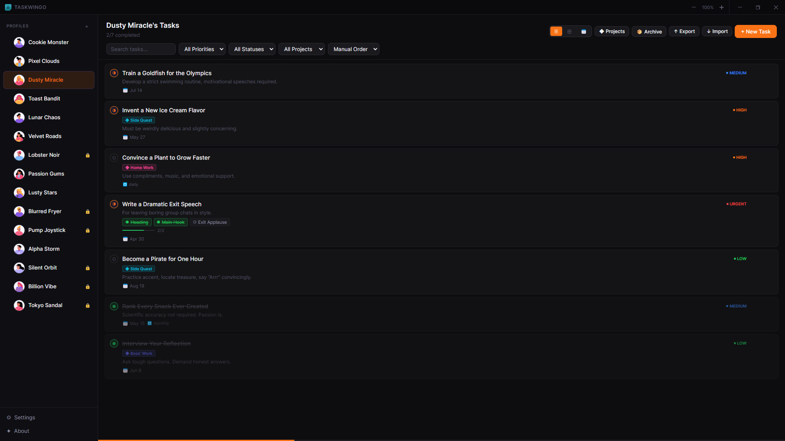
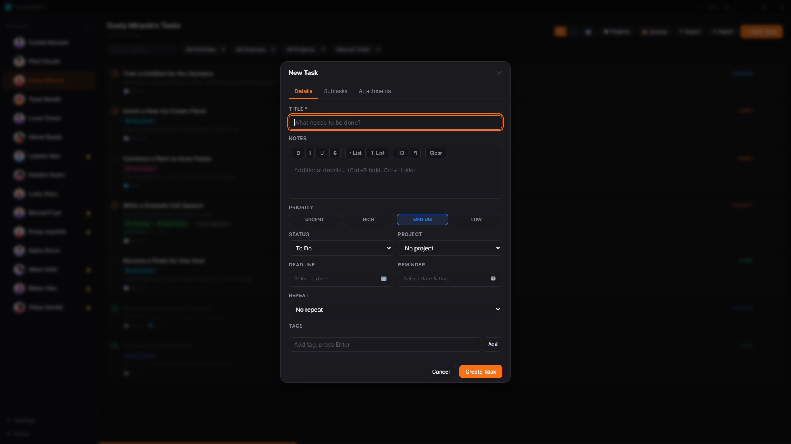
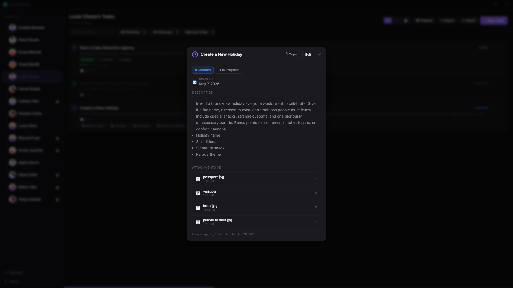
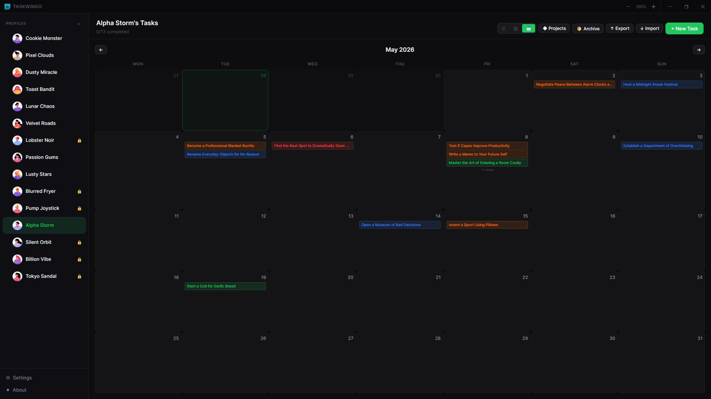
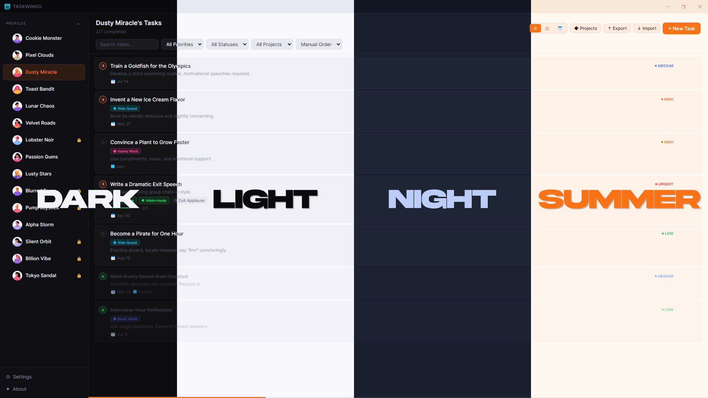

<div align="center">


# Taskwingo

**A clean, powerful personal task manager for desktop**

*Built with Electron · React · TypeScript · SQLite*

[](LICENSE)
[](https://github.com/gitwingo/taskwingo/releases)
[](https://github.com/gitwingo)

[Download](#installation) · [Features](#features) · [Screenshots](#screenshots) · [Build from Source](#build-from-source) · [Support](#support)

</div>
<div align="center">
  <a href="https://github.com/gitwingo/taskwingo/releases/download/v1.0.0/taskwingo.Setup.1.0.0.exe" 
     style="display: inline-block; 
            padding: 15px 30px; 
            font-size: 18px; 
            color: white; 
            background-color: #007bff; 
            text-decoration: none; 
            border-radius: 8px; 
            font-weight: bold;
            font-family: sans-serif;">
    Download Latest for Windows
  </a>
</div>
---

## Screenshots

### Task List


---

### Create New Task


---

### Task View


---

### Calendar View


---

### Themes


---

## Overview

Taskwingo is a fully offline, privacy-first desktop task manager. All your data stays on your machine — no accounts, no cloud, no subscriptions. It supports multiple profiles on a single PC, making it perfect for managing different identities, clients, or projects without mixing things up.

---

## Features

### Task Management
- Create, edit, delete, and reorder tasks with drag-and-drop
- Priority levels — **Urgent**, **High**, **Medium**, **Low** — with color indicators
- Status tracking — **To Do**, **In Progress**, **Done** — toggle directly from the task card
- Deadlines with overdue and upcoming visual warnings
- Reminders with desktop notifications
- Recurring tasks — Daily, Weekdays, Weekly, Monthly
- Tags for flexible labeling and filtering
- Subtasks with progress tracking
- Rich text notes — bold, italic, underline, bullet lists, numbered lists, headings
- File attachments — images, PDFs, videos, audio, Word docs, spreadsheets

### Organization
- **Projects** — group tasks under color-coded projects
- **3 views** — List, Kanban board, Calendar
- **Filters** — filter by priority, status, project, search, and sort order
- **Export** — CSV, JSON, HTML report, or full profile bundle
- **Import** — import tasks from JSON

### Profiles
- Create multiple independent profiles on one PC
- Per-profile avatar, bio, and saved links
- **PIN lock** per profile — set, change, or remove
- **Auto-lock** after configurable idle time
- Custom accent color per profile

### App
- **4 themes** — Dark, Light, Night, Summer
- Custom accent color (11 choices)
- Minimize to system tray — app keeps running in the background
- Window size and position remembered between sessions
- Fully offline — no internet required, no telemetry

---

## Installation

### Download (recommended)

Go to [Releases](https://github.com/gitwingo/taskwingo/releases) and download the latest version for your platform:

| Platform | File |
|----------|------|
| Windows  | `Taskwingo-Setup-x.x.x.exe` (installer) or `Taskwingo-x.x.x-portable.exe` |

---

## Build from Source

### Prerequisites

- [Node.js 20 LTS](https://nodejs.org/) (v20.x recommended)
- npm 9+
- On Windows: [Visual Studio Build Tools](https://visualstudio.microsoft.com/downloads/#build-tools-for-visual-studio-2022) with **"Desktop development with C++"** workload (required for `better-sqlite3`)

### Setup

```bash
# 1. Clone the repository
git clone https://github.com/gitwingo/taskwingo.git
cd taskwingo

# 2. Install dependencies
npm install

# 3. If better-sqlite3 fails on Windows, rebuild for Electron
npx @electron/rebuild -f -w better-sqlite3
```

### Development

```bash
npm run dev
```

### Build Installer

```bash
# Windows (.exe installer + portable)
npm run dist:win

# macOS (.dmg)
npm run dist:mac

# Linux (.AppImage + .deb)
npm run dist:linux
```

Output goes to the `dist/` folder.

---

## Tech Stack

| Layer | Technology |
|-------|-----------|
| Framework | Electron 29 |
| UI | React 18 + TypeScript |
| Build | electron-vite + Vite 5 |
| Database | better-sqlite3 (SQLite, local) |
| State | Zustand |
| Styling | CSS Variables (4 themes) |
| Packaging | electron-builder |

---

## Data & Privacy

All data is stored locally on your machine:

| Type | Location (Windows) |
|------|-------------------|
| Database | `%APPDATA%\taskwingo\data\taskwingo.db` |
| Attachments | `%APPDATA%\taskwingo\attachments\` |
| Window state | `%APPDATA%\taskwingo\window-state.json` |

No data is ever sent to any server. The app works fully offline.

---

## Project Structure

```
taskwingo/
├── electron/                  # Main process (Node.js)
│   ├── main.ts                # Window creation, tray, IPC setup
│   ├── preload.ts             # Secure contextBridge API
│   ├── ipc/                   # IPC handlers
│   │   ├── tasks.ts           # Task + subtask + project CRUD
│   │   ├── profiles.ts        # Profile management
│   │   ├── files.ts           # File attachment handling
│   │   ├── auth.ts            # PIN lock
│   │   └── export.ts          # CSV / JSON / HTML / import
│   └── db/                    # SQLite schema + migrations
├── src/                       # Renderer process (React)
│   ├── components/
│   │   ├── tasks/             # TaskList, TaskCard, TaskModal, Kanban, Calendar
│   │   ├── profiles/          # ProfileModal, ProfileAvatar, ProfileSwitcher
│   │   ├── auth/              # PinLock, PinManager
│   │   ├── settings/          # AppSettings, ThemePicker
│   │   ├── layout/            # TitleBar, Sidebar
│   │   └── about/             # AboutModal
│   ├── store/                 # Zustand global state
│   ├── types/                 # TypeScript types
│   ├── hooks/                 # Custom hooks
│   └── styles/                # CSS themes + global styles
└── public/                    # Static assets
```

---

## Contributing

Contributions are welcome! Feel free to open issues or submit pull requests.

1. Fork the repository
2. Create a feature branch (`git checkout -b feature/your-feature`)
3. Commit your changes (`git commit -m 'Add your feature'`)
4. Push to the branch (`git push origin feature/your-feature`)
5. Open a Pull Request

---

## Support

If Taskwingo has been useful to you, consider supporting its development:

<a href="https://ko-fi.com/gitwingo">
  
</a>

---

## Connect

- GitHub: [@gitwingo](https://github.com/gitwingo)
- Reddit: [u/gitwingo](https://reddit.com/user/gitwingo)
- X / Twitter: [@gitwingo](https://x.com/gitwingo)

---

## License

This project is licensed under the MIT License — see the [LICENSE](LICENSE) file for details.

---

<div align="center">
  <sub>Made with 💖 by <a href="https://github.com/gitwingo">Gitwingo</a></sub>
</div>
